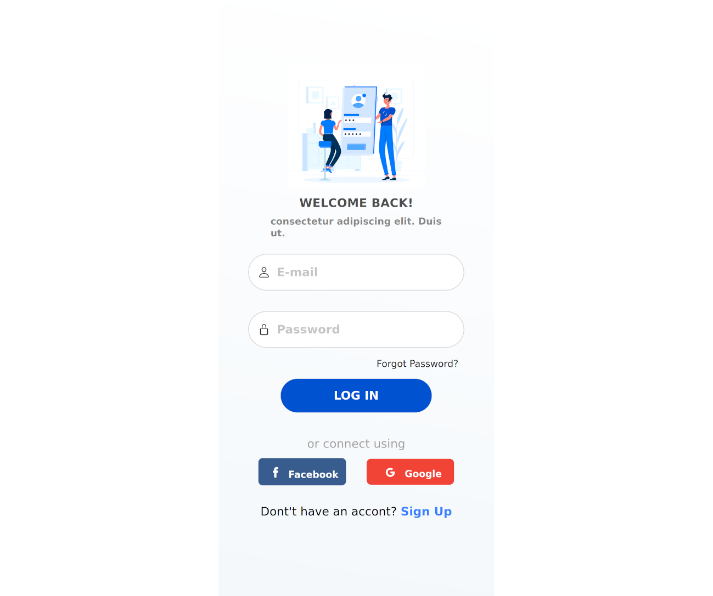
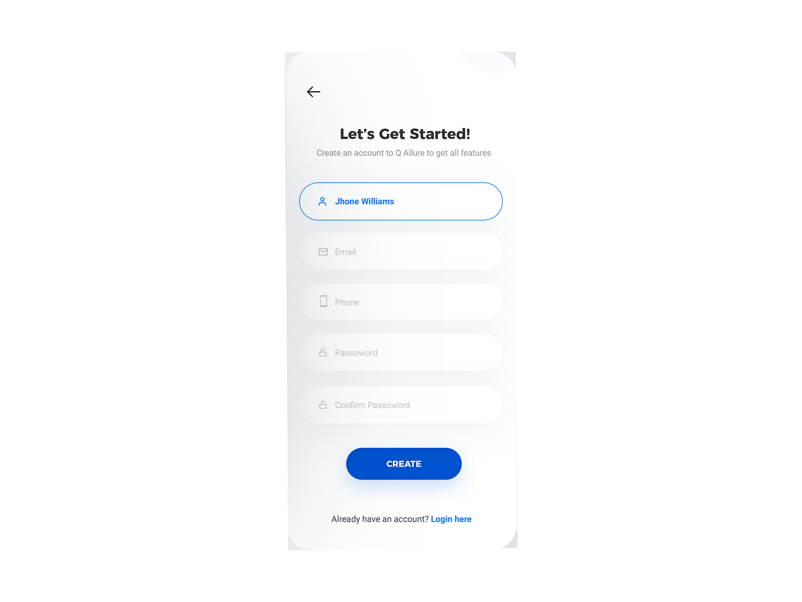

# Login Ionic v4

Authentication app with framework ionic  v4 and social login Facebook aen Google

##  Configuration  

###WEB
[https://forum.ionicframework.com/t/key-hash-for-facebook-not-working/44357/5]
Set APP_ID Facebbok developer in method FACEBOOK SDK in file login.page.ts  
Set CLIENT_ID Google api in method GOOGLE SDK in file login.page.ts


## NATIVE
hash app build 

This is how i solved this problem
Downloaded your APK to your PC in java jdk\bin folder

C:\Program Files\Java\jdk1.7.0_79\bin

go to java jdk\bin folder and run cmd then
copy the following command in your cmd

keytool -list -printcert -jarfile apkname.apk

Copy the SHA1 value to your clip board
like this CD:A1:EA:A3:5C:5C:68:FB:FA:0A:6B:E5:5A:72:64:DD:26:8D:44:84
and open http://tomeko.net/online_tools/hex_to_base64.php 1.4k to convert your SHA1 value to base64. This is what Facebook requires
get
zaHqo1xcaPv6CmvlWnJk3SaNRIQ= as our keyhash.
  
```
ionic cordova plugin add cordova-plugin-facebook4 --save --variable APP_ID="app_id-facebook" --variable APP_NAME="nameapp"
```  
   
and  
  
create 2 credentials on console.cloud.google.com  
web and android  

```
$ cordova plugin add cordova-plugin-googleplus --save --variable REVERSED_CLIENT_ID=myreversedclientid
```


# Mockup

## Sign in

O App de login tera os métodos de autorização por API utilizando o JWT e autenticação  
do facebook e google e sera responsivo utilizando os beneficios de um app hibrido


</img>

## Sign up
Em processo de desenvolvimento

 </img>
